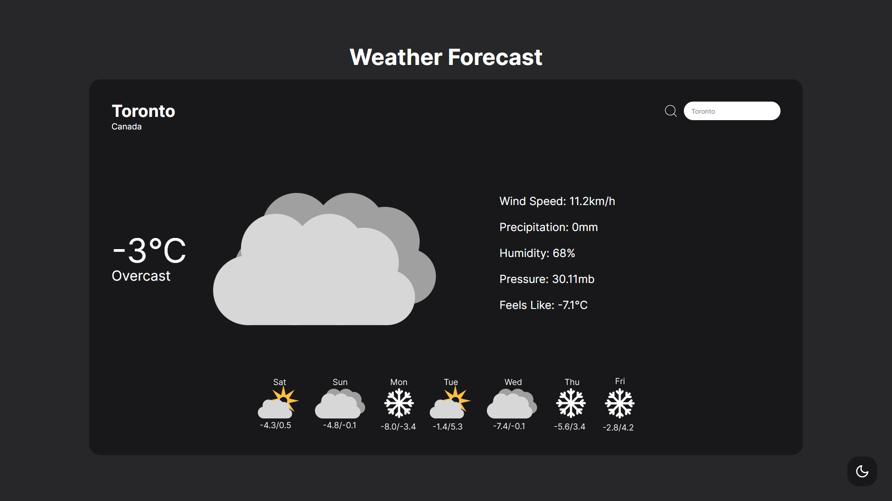
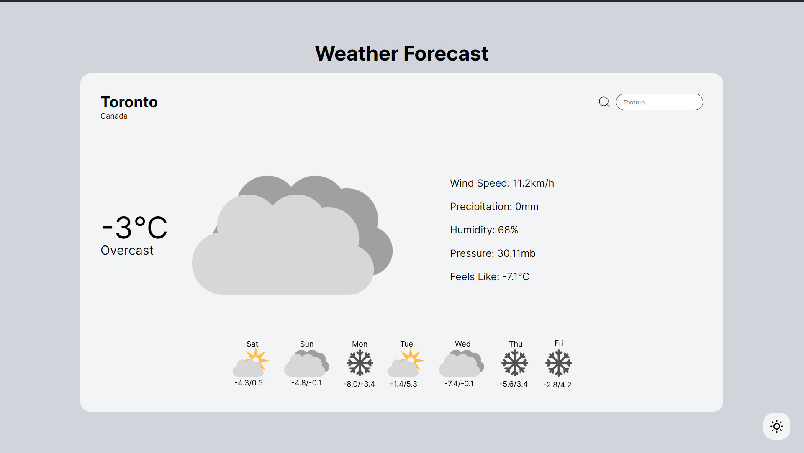

# :cloud: **React Weather App** 

# :earth_americas: Search Anywhere in the World!

# :heart: Dark/Light Mode
### Look at Weather Without Staring Into the Sun(unless you like light mode)

# Technologies

     	